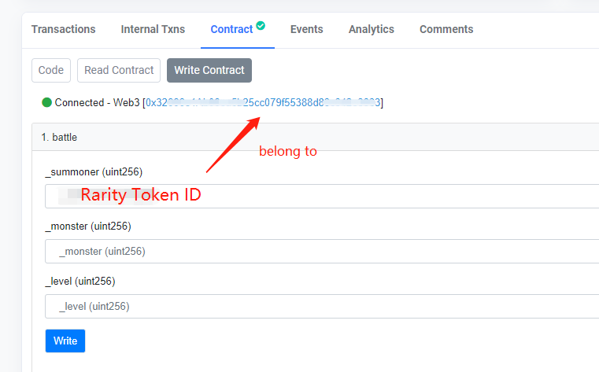

# README



## README

**Salute to Rarity and Loot**

## Addresses

| Name | Address |
| :--- | :--- |
| Rarity Contract | [0xce761D788DF608BD21bdd59d6f4B54b2e27F25Bb](https://ftmscan.com/address/0xce761D788DF608BD21bdd59d6f4B54b2e27F25Bb) |
| Rarity Battle Contract | [0x42b18313fc4b4b93916a2a454f0f0b7c8fde27c7](https://ftmscan.com/address/0x42b18313fc4b4b93916a2a454f0f0b7c8fde27c7) |
| Monster Contract | [0x2D2f7462197d4cfEB6491e254a16D3fb2d2030EE](https://ftmscan.com/address/0x2D2f7462197d4cfEB6491e254a16D3fb2d2030EE) |

## \(Rarity Battle Contract\) PVE: How to play

Click the link below:

[https://ftmscan.com/address/0x42b18313fc4b4b93916a2a454f0f0b7c8fde27c7](https://ftmscan.com/address/0x42b18313fc4b4b93916a2a454f0f0b7c8fde27c7#writeContract)

* Prerequisite:

  Make sure the ID of the Rarity hero belongs to your address

* Scene I: wipe out a specific monster
  * Method 1: specific monster + specific level

    Call Battle function, input Rarity Token ID, Monster Token ID and Monster Level.

  * Method 2: specific monster only

    Call Battle function, input Rarity Token ID, Monster Token ID and 0 for Monster Level \(Monster Level will be the same as your Rarity hero' s level\)
* Scene II: Encounter
  * Method 1: random monster + specific level

    Call Battle function, input Rarity Token ID, Monster Level and 0 for Monster Token ID.

  * Method 2: random monster + specific level

    Call Battle function, input Rarity Token ID, 0 for monster Token ID and Monster Level.
* Notice: 1. 0 means random for monster selection 2. 0 means the same level as your Rarity hero' s level 3. The amount of copper is positively correlated with monster's level, the higher the level is, the more copper you'll get. 4. The ratio to win is decided by level difference, the higher hero's level is than monster's level, the more likely you're going to win.
* The formula to win:
  * When hero's level is greater than or equal with monster's level, x is the level difference, y is ratio to win, y = \(x^2+4\)/\(x^2+5\)
  * When monster's level is greater than hero's level, x is the level difference, y is ratio to win, y = 1/\(x^2+2\)

## \(Monster Contract\) MonsterNFT Instruction

Monster NFT is a kind of NFT asset randomly generated and stored on the blockchain with different names, careers, and random properties, which can be used in any scene. The rarity of monster NFT is determined by its career, properties, and game ecology. Level, scene, and appearance are omitted as part of further expansions.

### Contract Address

[https://ftmscan.com/address/0x2D2f7462197d4cfEB6491e254a16D3fb2d2030EE](https://ftmscan.com/address/0x2D2f7462197d4cfEB6491e254a16D3fb2d2030EE)

### Summon

Step1. Click on: [https://ftmscan.com/address/0x2D2f7462197d4cfEB6491e254a16D3fb2d2030EE](https://ftmscan.com/address/0x2D2f7462197d4cfEB6491e254a16D3fb2d2030EE)

Step 2. Pay 10 FTM with claim function to summon a monster

### Quantity and Distribution

The total amount of Monster NFT is 11,000. Among which, the first 10,000 are randomly distributed to community users and the rest 1,000 belong to the development team.

### Career and Property

Monster's property is constituted of 60 points of basic properties and 30 points of random properties. The basic properties are as follows:

[Instantly View](https://github.com/crypto-shuraba/MonsterNFT/tree/56312831be1ccf922dde49fddcb0c283b752589e/README%2045600350dd3a4a71aaddb5cc7b5d87f7/Instantly%20View%20542f0c2db21a4273bd49d2ff81a40d13.csv)

### Monster Dictionary

There are 79 kinds of monsters and 15 kinds of careers that have the corresponding numbers as follows:

[Instantly View](https://github.com/crypto-shuraba/MonsterNFT/tree/56312831be1ccf922dde49fddcb0c283b752589e/README%2045600350dd3a4a71aaddb5cc7b5d87f7/Instantly%20View%20d694f54fdd854b21a9556976ca5be3c0.csv)

### Monster Prefix

We design some interesting adjectives that can be randomly united with monsters as follows:

Angry,Hungry,Scary,Damned,Corrupt,Gloomy,Horrific,Ghostly,Freaky,Amnesic,Painful,Overjoyed,Sorrowful,Blusterous,Degraded

### Future Outlook

A complete metaverse contains not only heroes but also monsters. Community developers are welcome to interact with the metaverse to build more fun game scenes. Please feel free to contact us for any developers, art designers, and game planners who are interested in our game. Let's strive together to create the metaverse ecology.

**Contact Us**

Gmail: [cryptoshuraba@gmail.com](mailto:cryptoshuraba@gmail.com)

Twitter: [https://twitter.com/Crypto\_Shuraba](https://twitter.com/Crypto_Shuraba)

**Link Exchange**

Rarity: [https://github.com/andrecronje/rarity](https://github.com/andrecronje/rarity)

Loot: [https://www.lootproject.com/](https://www.lootproject.com/)

